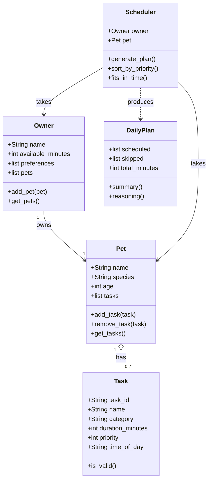

# PawPal+ UML Class Diagram

```mermaid
classDiagram
    class Owner {
        +String name
        +int available_minutes
        +list preferences
        +list pets
        +add_pet(pet)
        +get_pets()
    }

    class Pet {
        +String name
        +String species
        +int age
        +list tasks
        +add_task(task)
        +remove_task(task)
        +get_tasks()
    }

    class Task {
        +String task_id
        +String name
        +String category
        +int duration_minutes
        +int priority
        +String time_of_day
        +is_valid()
    }

    class Scheduler {
        +Owner owner
        +Pet pet
        +generate_plan()
        +sort_by_priority()
        +fits_in_time()
    }

    class DailyPlan {
        +list scheduled
        +list skipped
        +int total_minutes
        +summary()
        +reasoning()
    }

    Owner "1" --> "1..*" Pet : owns
    Pet "1" o-- "0..*" Task : has
    Scheduler --> Owner : takes
    Scheduler --> Pet : takes
    Scheduler ..> DailyPlan : produces
```
